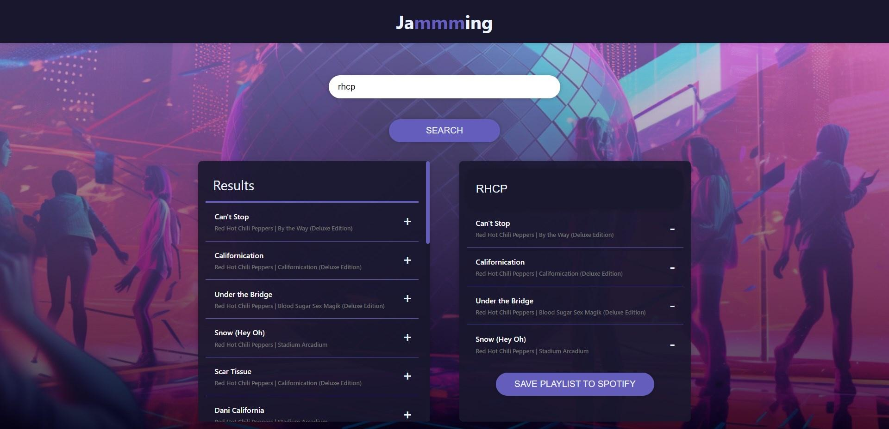

# Jammming

## Description

Jammming is a web application built with React that lets users search the Spotify library, create a custom playlist, and save it to their Spotify account. This is an educational project is focused on React and the Spotify API, and how they can work together to build an application.

## Demo

The app is deployed [here](https://oaktec.github.io/jammming/).

## Instructions

- In order to use the app, you must first log in to your Spotify account. Click on the 'Log in to Spotify' button and approve the app to access your Spotify account.
- To search for songs, simply input a search term in the search bar and hit 'Search'. A list of tracks matching your query will be displayed with their title, artist, and album information.
- To create a playlist, click on the '+' button next to the song you want to add. It will then appear in your custom playlist on the right side of the screen.
- To remove a song from your playlist, click on the '-' button next to the song you want to remove. It will then be removed from your custom playlist.
- You are required to enter a name for your playlist before you can save it to your Spotify account. Enter a name in the 'Playlist Name' field.
- When you are satisfied with your playlist, click 'Save to Spotify'.

## Technologies Used

- **HTML5**
- **CSS3**
- **JavaScript**
- **React**
- **Spotify API**
- **Git & GitHub**
- **Deployed on GitHub Pages**
